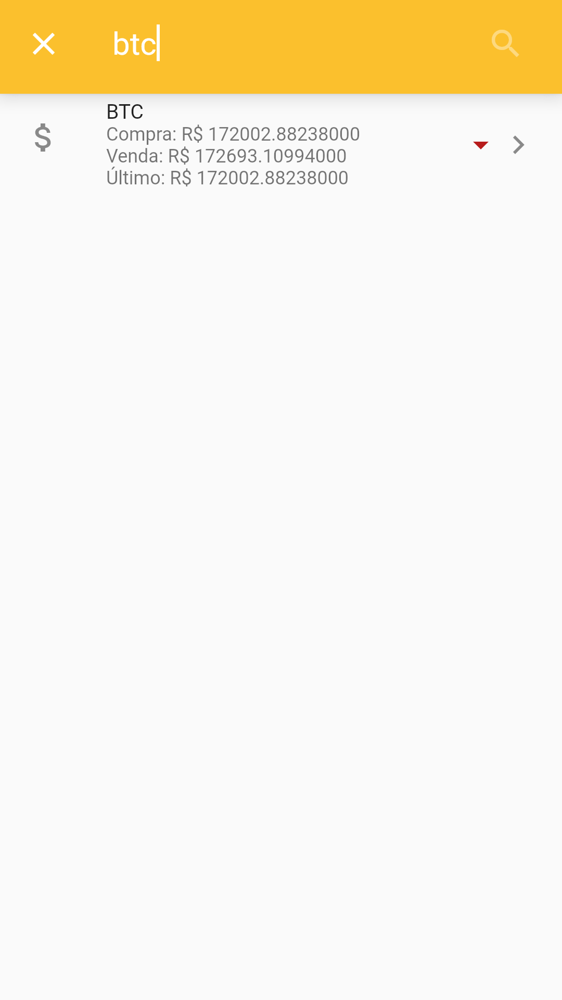
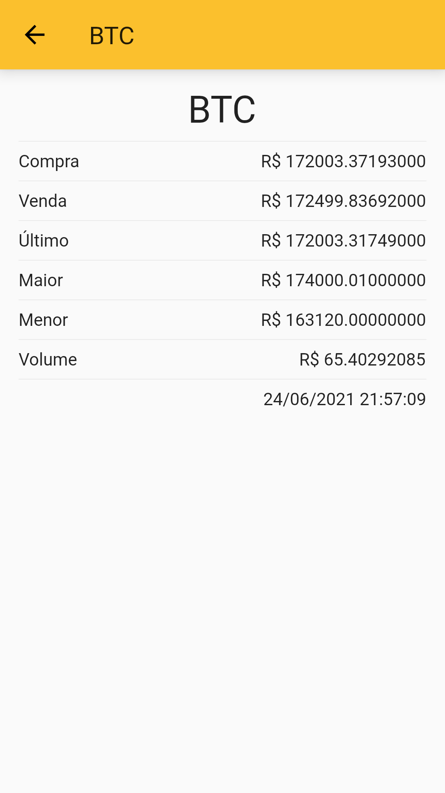
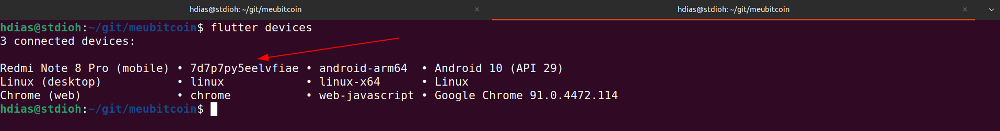

# meubitcoin
App using the api from https://mercadobitcoin.com.br/


# Requirements
* [Flutter >= 2](https://flutter.dev/docs/get-started/install)
* [Android SDK](https://developer.android.com/studio#downloads)
* [Chrome Browser](https://www.google.com/intl/en-US/chrome/)

# Setup
```shell
git clone https://github.com/stdioh321/meubitcoin.git
cd meubitcoin
flutter pub get
```

# Run on Chrome
```shell
flutter run -d chrome --no-sound-null-safety
```
**Your chrome browser will open at localhost in some random port.**
Home | Home Pesquisa | Detalhes |
--- | --- | --- |
 |  |  |


# Run on Android

Plug your android device to the computer with the debub mode enabled.


```shell
# Get your android device id
flutter devices
flutter run -d [ANDROID_DEVICE_ID] --no-sound-null-safety 

```

# References
* [Mercado Bitcoin](https://www.mercadobitcoin.com.br/)
* [Flutter](https://flutter.dev/)