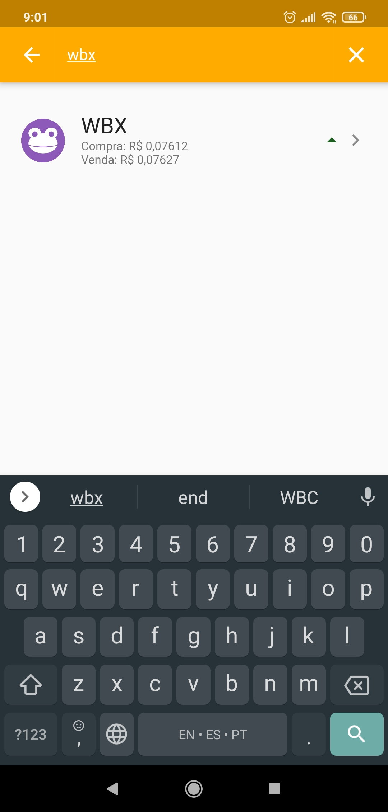

# MeuBitcoin
App that list the coins from **mercadobitcoin**,show your details and allows the user to setup alerts, using the api from https://mercadobitcoin.com.br/


# Client Requirements
* [Flutter >= 2](https://flutter.dev/docs/get-started/install)
* [Android SDK](https://developer.android.com/studio#downloads)

# Setup Client
```shell
git clone https://github.com/stdioh321/meubitcoin.git
cd meubitcoin/client
flutter pub get
```

# Run on Android

Plug your android device to the computer with the debug mode enabled.


```shell
# Get your android device id
flutter devices
flutter run -d [ANDROID_DEVICE_ID]

```
Home | Home Search | Details |
--- | --- | --- |
 |  |  |

Home | Home Search | 
--- | --- | 
 |  |


# References
* [Mercado Bitcoin](https://www.mercadobitcoin.com.br/)
* [Flutter](https://flutter.dev/)